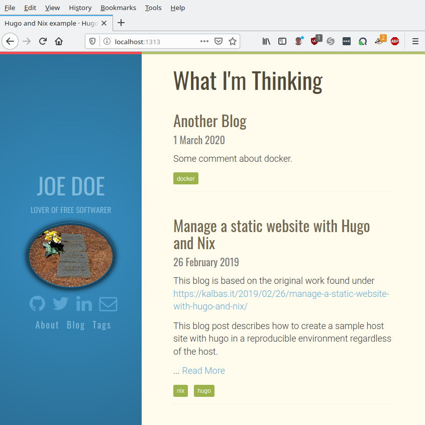

# This a very simple example of howto use Nix and Hugo to build a static website

This work was inspired by https://kalbas.it/2019/02/26/manage-a-static-website-with-hugo-and-nix/

# Setup

## Installing Nix

If you'd like to follow along this tutorial, then you should have
installed [Nix](https://nixos.org/nix/) on your system.

Nix can be installed by following the instructions
[here](https://nixos.org/nix/download.html). At the time of writing this
guide, Nix can be installed by simply running `curl
https://nixos.org/nix/install | sh` as a non-root user.

Please note that if you would like to uninstall nix, simply remove the
directory `/nix`.

## Reproducible environment using a git checkout of this repository

Once you have nix and git installed the following sequence of commands should suffice

```
git clone https://github.com/ngiger/hugo-nix-example.git
cd hugo-nix-example
# the next command will read the shell.nix file and execute the commands hugo version and hugo server
niklaus@librem /o/s/hugo-nix-example (master)> nix-shell bootstrap_hugo.nix --command 'hugo version && hugo server'
Hugo Static Site Generator v0.64.0/extended linux/amd64 BuildDate: unknown
Building sites … WARN 2020/03/11 18:28:20 Page.Hugo is deprecated and will be removed in a future release. Use the global hugo function.

                   | EN  
-------------------+-----
  Pages            | 21  
  Paginator pages  |  0  
  Non-page files   |  1  
  Static files     | 80  
  Processed images |  0  
  Aliases          |  1  
  Sitemaps         |  1  
  Cleaned          |  0  

Built in 28 ms
Watching for changes in /nix/store/{9vmsbv3n336m0jj8svf4vm3xdbs18f9q-hugo-themes,icgz3q87ikyx4gpq2hmb8q50grvi6020-layouts}
Watching for changes in /opt/src/hugo-nix-example/{content,static}
Watching for config changes in /opt/src/hugo-nix-example/config.json
Environment: "development"
Serving pages from memory
Running in Fast Render Mode. For full rebuilds on change: hugo server --disableFastRender
Web Server is available at http://localhost:1313/ (bind address 127.0.0.1)
Press Ctrl+C to stop
```

Now enter in your browser the URL http://localhost:1313 and you should see



Photo from https://en.wikipedia.org/wiki/John_Doe#/media/File:John_and_Jane_Doe_Headstones.jpp (Public Domain)

## Adapting to your needs

Beware that when whenever you changed a *.nix file. You must stop the hugo server (Ctrl-C), leave the nix shell and call `nix-shell bootstrap_hugo.nix --command 'hugo server'` again.

when you change text elsewhere, eg. content/post/another-blog.md you should see the changed output almost immediately.

https://kalbas.it/2019/02/26/manage-a-static-website-with-hugo-and-nix/ describes some details of the setup via nix and how the themes were installed.
